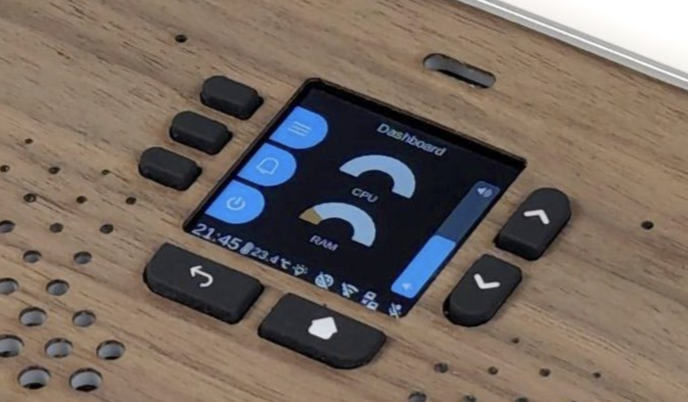

# Ubo Pod and its SDK

## What is Ubo Pod

Ubo Pod enables developer communities to bring openness, transparency, and privacy to the device ecosystem. Go beyond proprietary and walled gardened platforms!
It has an LCD screen, a camera, a microphone, a pair of speakers, a set of buttons, some sensors, an LED ring, and a Raspberry Pi 4 inside.
All the inputs and outputs on the Ubo Pod case are connected to the Raspberry Pi 4 through a custom PCB.
So it is basically a light weight, portable, and open-source computer that doesn't need a monitor, a keyboard, or a mouse to interact with it.
Optionally you can connect AI accelerators like [Raspberry Pi AI Kit](https://www.raspberrypi.com/news/raspberry-pi-ai-kit-available-now-at-70/) and [Google Coral USB Accelerator](https://coral.ai/products/accelerator) to the Ubo Pod to run machine learning models on the edge to have your own AI assistant.

## Our Vision

We want to create a platform that is open, transparent, and respects the privacy of its users. So everything including the hardware as well as the software is open-source. Any proprietary element is opt-in.
We believe that the Ubo Pod can be a great tool for developers to create applications that are not possible on other platforms. We want to create a community around the Ubo Pod that will help us to achieve this vision.

## Ubo App

Ubo App is a Python library that allows you to interact with the Ubo Pod. It is compatible with Python 3.11 and above.
It is designed to eventually expose its API to other programming languages via JSON-RPC. So you can use it with many programming languages including JavaScript, Python, C++, Rust, Go, Ruby, Java, etc.
It includes an SDK for developers to create their applications for Ubo Pod as well as a runner app that hosts those applications.

## Getting Started with Ubo App

Follow the installation instructions [here](https://github.com/ubopod/ubo_app#-installation) to install it on your Ubo Pod.
In case you don't have access to an Ubo Pod yet, you can follow the instructions provided [here](https://github.com/ubopod/ubo_app#development) to set up a development environment on your computer. You can write and test your applications on your computer before deploying them to an Ubo Pod.

## Core Design

Ubo App has a lightweight core. It is designed to be modular and extensible. It is composed of several modules named "Ubo services" or simply "services" that are responsible for different parts of the system. Anyone can write a new service and plug it into the system on their own pods or share it with the community.
Ubo App runs on top of a redux-like store. It is a single source of truth for the whole system. Each service can subscribe to the relevant parts of the store and react to changes.
Reducers in the [redux implementation used in Ubo App](https://github.com/sassanh/python-redux) have the extra capability of returning a list of side effects.
The core mostly consists of a nested menu in the middle and a narrow footer in the bottom. The core only implements these menu items:

- Main Menu
  - Apps Menu
  - Settings Menu
  - About (Let's the user to check the version of the Ubo App, and update it if a new version is available)
- Notification
- Power Off

The footer renders a clock next to temperature and light sensor readings on the left and bunch of status icons on the right. The core doesn't provide any status icons itself. It is up to the services to register their own status icons.

## Ubo Services

Each service can register one or multiple icons in the footer and/or register one or multiple menu items in "Apps" and/or "Settings" top-level menus.
The user will be able to interact with the modules through these menu items. Each menu item can be of any of these four types:

## The Menus

1. **Item**: This is the base class for all menu items. It by itself doesn't do anything upon selection. So this is solely presentational. It has these fields:
   - `label`: The text that will be shown in the menu
   - `icon`: Any of the nerd-fonts icons. You can find the list of icons [here](https://www.nerdfonts.com/cheat-sheet)
   - `color`: The color of the icon and the label
   - `background_color`
   - `is_short`: When set to `False` (default), it will take the full width of the screen. When set to `True`, it will hide the label and only show the icon and will take a small space in the left edge of the screen, just enough to show the icon.
   - `opacity`
1. **ApplicableItem**: It opens a custom view when selected. The view can be any Kivy widget. You can use `.kv` files to define the layout of the view.
1. **SubMenuItem**: It opens a nested sub-menu consisting of its own menu items when selected.
1. **ActionItem**: It triggers an action provided by the `action` field when selected. The action can be any Python callable. In its advanced usage, it can return another `ApplicableItem`, or `SubMenuItem` so that after running the action, that item is selected.

There are other details regarding the modules that are not covered here. You can find more information in the [Ubo App documentation](https://ubo-app.readthedocs.io/en/latest/).

## Conclusion

In this post, we introduced you to the Ubo Pod and Ubo App. We explained the vision behind the project and how you can get started with Ubo App. We also explained the core design of Ubo App and how you can write your own services for it.

In the upcoming posts, we will dive deeper into the Ubo App and its SDK. We will cover topics in these areas:

1. How to write your own services/application and plug them into the Ubo App
1. Core design of Ubo App and how it works
1. The challenges we faced while developing Ubo App and how we solved them
1. The future of Ubo App and how you can contribute to it

We are excited to see what you will build with Ubo Pod and Ubo App. We are looking forward to your contributions to the project. If you have any questions, feel free to create an issue in the [Ubo App repository](https://github.com/ubopod/ubo_app/issues/new)
